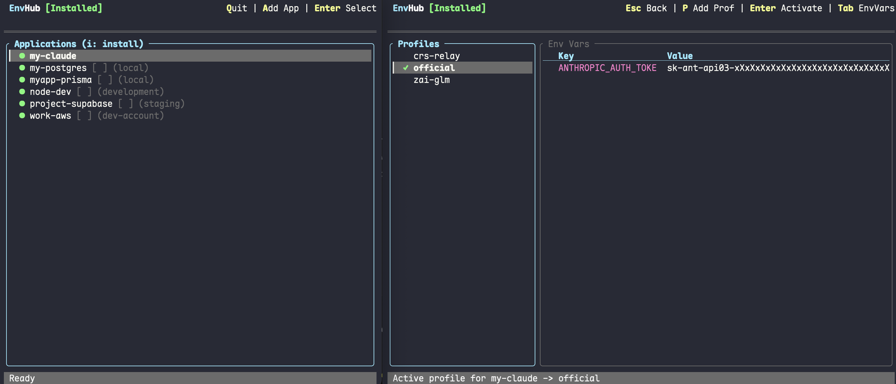

# EnvHub

**EnvHub** is a powerful, lightweight terminal-based tool for managing environment variables across different applications and profiles. It allows you to switch between `development`, `staging`, and `production` environments seamlessly without manually editing files or managing complex shell scripts.


<p align="center">
  
</p>

## ✨ Features

- 🖥️ **Interactive TUI**: A beautiful terminal user interface built with `ratatui`.
- 🔄 **Profile Switching**: Instantly switch environment profiles (Dev/Prod/Staging) for any application.
- 🚀 **Zero Overhead**: The launcher is written in Rust for minimal latency and extreme performance.
- 🛠️ **Automatic Shims**: Automatically manages binary wrappers so you don't have to change your workflow.
- 📦 **Cross Platform**: Works on macOS, Linux, and Windows.

## 🚀 Installation

The easiest way to install EnvHub is via the one-line installer:

```bash
curl -fsSL https://raw.githubusercontent.com/sontallive/envhub/main/install.sh | sh
```

*For Windows users, please download the latest executable from the [Releases](https://github.com/sontallive/envhub/releases) page.*

## 🛠️ Quick Start

1.  **Launch EnvHub**:
    Type `envhub` in your terminal to open the TUI.

2.  **Add an App**:
    Press `A` to register a new application. **Important**: The app name you enter acts as an **alias** (a new command name) that EnvHub will manage.

    > **Best Practice**: Use a **different name** from the original command to keep both versions available. For example:
    > - Original command: `claude` → EnvHub alias: `iclaude` or `claudex`
    > - Original command: `node` → EnvHub alias: `inode` or `nodex`
    >
    > This way, you can use `claude` for the original command and `iclaude` when you need EnvHub's environment management.

    > **How it works**: When you add an alias called `iclaude`, EnvHub creates a shim executable with that name. When you run `iclaude` in your terminal, EnvHub's wrapper will execute, inject the environment variables from your active profile, and then call the original `claude` binary.

    > **Critical**: When prompted for the "target binary", you **must** provide the full path to the original command (use `which claude` to find it, e.g., `/usr/local/bin/claude`).

3.  **Define Profiles**:
    Create profiles like `dev` or `prod` and add your environment variables.

4.  **Use Your Alias**:
    Once an app is managed by EnvHub, use the alias you created:
    ```bash
    # If you created an alias 'iclaude' for 'claude':
    iclaude code  # Uses EnvHub's environment variables

    # The original command still works without EnvHub:
    claude code   # Uses default environment
    ```

## 💡 Use Cases

### 1. Claude Code (Multi-Provider & Performance)
Claude Code is a powerful agentic CLI tool. With EnvHub, you can easily switch between the official Anthropic API, third-party providers (like Z.AI), or self-hosted relays (like CRS), without manually editing configuration files.

*   **Alias**: `iclaude` *(or `claudex`, `myclaude` - choose any name you like)*
*   **Target Binary**: `/usr/local/bin/claude` *(use `which claude` to find your path)*
*   **Usage**: Run `iclaude code` to use EnvHub-managed profiles, `claude code` for original behavior
*   **Profiles**:
    *   **`official`**:
        *   `ANTHROPIC_AUTH_TOKEN`: `sk-ant-xxx`
    *   **`zai-glm`** (High cost-performance):
        *   `ANTHROPIC_AUTH_TOKEN`: `your_zai_api_key`
        *   `ANTHROPIC_BASE_URL`: `https://api.z.ai/api/anthropic`
        *   `ANTHROPIC_DEFAULT_SONNET_MODEL`: `glm-4.7`
        *   `ANTHROPIC_DEFAULT_HAIKU_MODEL_`: `glm-4.5-air`
        *   `ANTHROPIC_DEFAULT_OPUS_MODEL`: `glm-4.7`
    *   **`crs-relay`** (Self-hosted / Shared):
        *   `ANTHROPIC_AUTH_TOKEN`: `your_crs_key`
        *   `ANTHROPIC_BASE_URL`: `http://your-relay-server:3000/api/`

### 2. AWS Account & Region Switching
Avoid manually exporting `AWS_PROFILE` or keys. Define profiles for different accounts or environments.

*   **App**: `aws`
*   **Profiles**: `work-dev`, `work-prod`, `personal-oss`.

### 3. Database Migration & Access
Ensure your migration scripts or CLI clients always hit the right database.

*   **App**: `psql`, `prisma`, `supabase`
*   **Profiles**: `local`, `staging`, `production`.

## 🏗️ Architecture

EnvHub consists of three main components:

-   **`envhub-core`**: The logic engine that manages state and configuration.
-   **`envhub-tui`**: The interactive interface for managing your apps and variables.
-   **`envhub-launcher`**: A high-performance shim that intercepts command calls and injects the correct environment variables.

### How the Alias/Shim System Works

1.  **App Registration**: When you add an app in EnvHub, you provide two things:
    - **Alias name**: A new command name (e.g., `iclaude`, `inode`) that you'll use to invoke the managed version
    - **Target binary**: The full path to the original executable (e.g., `/usr/local/bin/claude`)
2.  **Shim Creation**: EnvHub creates a lightweight binary shim with the alias name in its managed directory.
3.  **Dual Access**: After installation:
    - Running your **alias** (e.g., `iclaude`) → uses EnvHub with environment variable injection
    - Running the **original command** (e.g., `claude`) → works normally without EnvHub
4.  **Interception & Injection**: When you run the alias, the shim reads your active profile from EnvHub's config, injects the environment variables, and then executes the **target binary** you specified.
5.  **Zero Overhead**: The launcher is written in Rust and adds less than 1ms of latency, making it imperceptible in daily use.

**Key Points**:
- **Recommended**: Use a different alias name (e.g., `iclaude` instead of `claude`) to keep both managed and unmanaged versions available.
- The target binary **must be a full path** to avoid resolution issues. Use `which <command>` to find the original binary's location before registering.
- You choose the alias name—it can be anything you like (e.g., `myclaude`, `claudex`, `inode`, `mynode`).

## 🛠️ Development

If you want to build from source:

```bash
# Clone the repository
git clone https://github.com/sontallive/envhub.git
cd envhub

# Build all components
cargo build --release

# Run the TUI
cargo run -p envhub-tui
```

## 📄 License

This project is licensed under the MIT License - see the [LICENSE](LICENSE) file for details.

## 🤝 Contributing

Contributions are welcome! Please feel free to submit a Pull Request.

---

Built with ❤️ using Rust.
